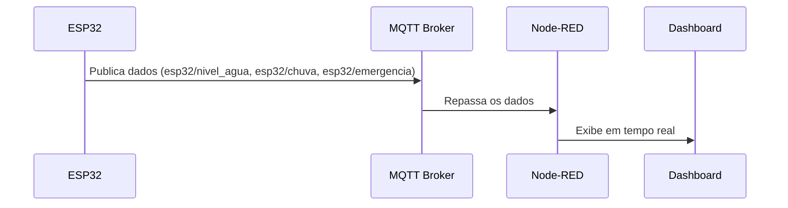
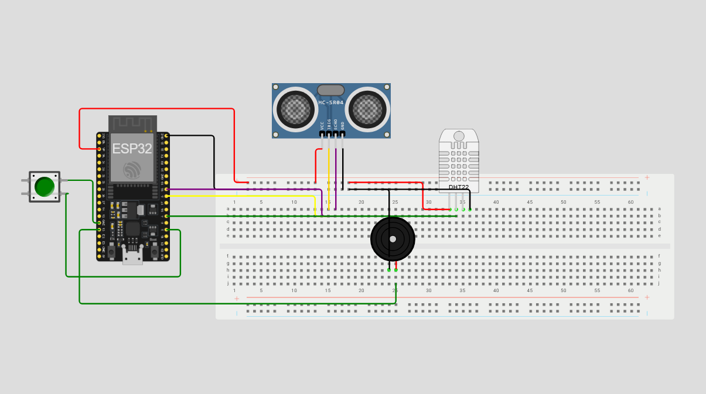
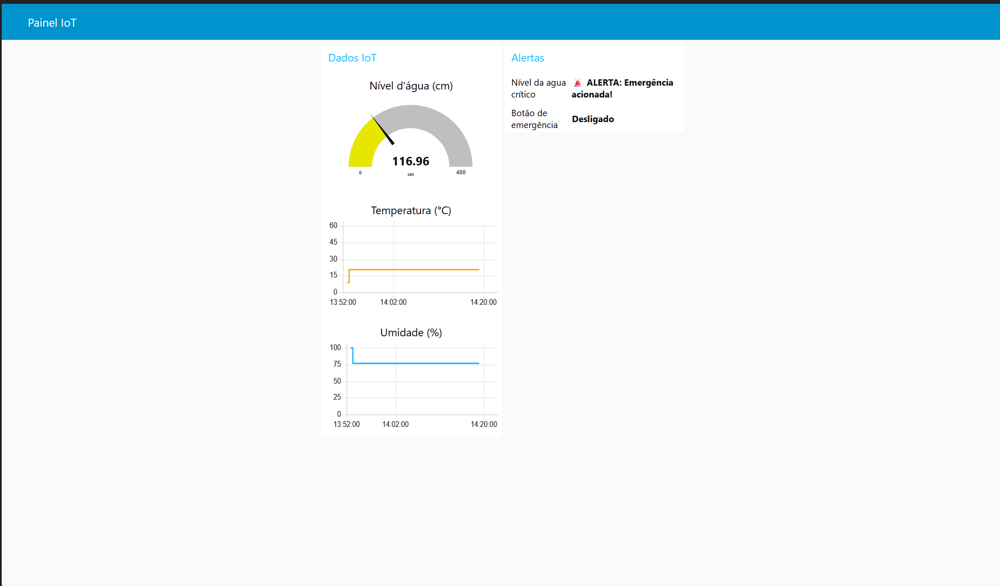
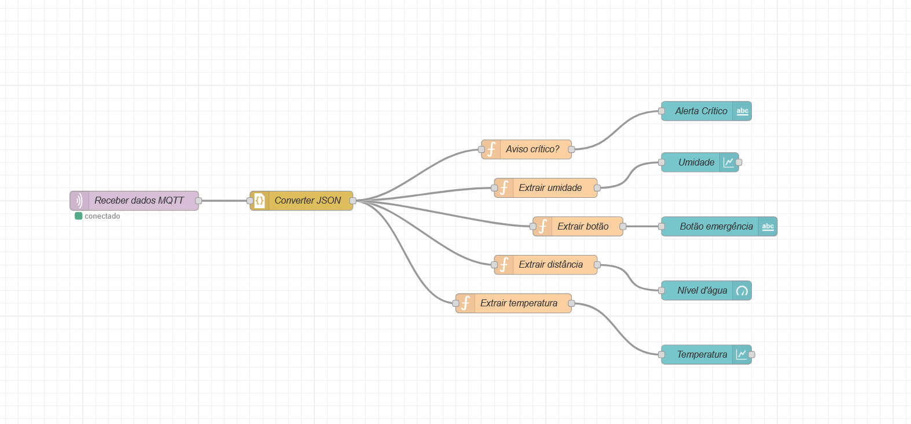

# Sistema de Monitoramento com ESP32 e Node-RED via MQTT

* RM557886 - Eduardo Guilherme Dias
* RM558637 - Gabriel Alves Thomaz
* RM557652 - Luiz Sadao Kamada

## Descrição do Projeto

Este projeto implementa um sistema de monitoramento baseado em **ESP32**, que coleta dados de sensores (sensor de nível de água, sensor de chuva e botão de emergência) e os envia via protocolo **MQTT** para um **servidor Node-RED**, que exibe as informações em tempo real através de dashboards interativos. Um buzzer é ativado em caso de nível de água crítico ou acionamento do botão de emergência.

### Componentes:

* **ESP32** com sensores conectados
* **Sensor de Nível de Água**
* **Sensor de Chuva**
* **Botão de Emergência**
* **Buzzer de Alerta**
* **Broker MQTT** (utilizado: `broker.hivemq.com`)
* **Servidor Node-RED** com dashboard

## Estrutura do Repositório

```
projeto-monitoramento-iot/
├── imagens/
│   ├── dashboard.png
│   ├── esp32.png
│   └── fluxo-nodered.png
├── esp32/
│   ├── diagram.json.png
│   └── codigo_esp32.ino
├── nodered/
│   └── fluxo_nodered.json
└── README.md
```

## Requisitos

* Placa **ESP32**
* **Arduino IDE** ou VSCode com PlatformIO
* **Node.js** + Node-RED
* Acesso à internet

## Configuração e Execução

### Node-RED

1. Instale Node-RED:

```bash
npm install -g --unsafe-perm node-red
```

2. Inicie o Node-RED:

```bash
node-red
```

3. Acesse `http://localhost:1880`
4. Importe o fluxo JSON de `nodered/fluxo_nodered.json`
5. Acesse o dashboard em `http://localhost:1880/ui`

## Fluxo do Node-RED

### Principais nós:

* **MQTT IN**: escuta os tópicos `esp32/nivel_agua`, `esp32/chuva`, `esp32/emergencia`
* **Function Nodes**: processam os dados recebidos
* **Dashboard Nodes**: exibem os dados em gráficos e indicadores
* **Alerta Sonoro**: buzzer é acionado se o nível da água for crítico ou o botão de emergência for pressionado

### Diagrama de Fluxo



## Testes

1. Verifique o Serial Monitor (115200 baud) do ESP32:

   * Mensagens de conexão Wi-Fi e publicação
2. No Node-RED, certifique-se de que o fluxo está ativo
3. Acesse o dashboard e visualize os dados dos sensores
4. Simule condições de emergência:

   * Altere o nível de água para um valor crítico
   * Pressione o botão de emergência
   * Verifique se o buzzer é acionado

## Imagens

| Componentes                       | Dashboard                           | Fluxo Node-RED                      |
|-----------------------------------| ----------------------------------- | ----------------------------------- |
|  |  |  |

## Conclusão

Este projeto é uma prova de conceito de uma solução IoT simples e eficiente, com comunicação MQTT entre um ESP32 e o Node-RED. Ele permite monitoramento de variáveis ambientais críticas, como nível de água e chuva, além de oferecer uma interface de emergência. O sistema apresenta os dados em um painel interativo e pode ser facilmente adaptado para outros tipos de sensores e funcionalidades adicionais.
